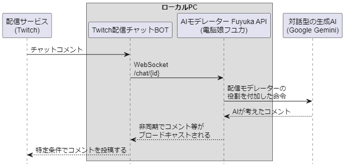

# Twitch配信チャットBOT

## 概要

このプロジェクトは、Twitchの配信チャットを監視してコメントを返すBOTです。

このソフトウエア単体では配信チャットのコメントに返信できません。
[電脳娘フユカ (AIモデレーター Fuyuka API)](https://github.com/natukin1978/ai-moderator-fuyuka)を一緒に使う必要があります。

#### シーケンス図



## 重要

このソフトは基本的にノーサポートです。
このソフトウェアの使用に関して、以下の点をご了承ください:

- 本ソフトウェアの使用により生じた、いかなる損害、障害、トラブルについても、作者は一切の責任を負いません。
- 本ソフトウェアの機能、性能、安全性、信頼性などに関して、いかなる保証も行いません。
- 本ソフトウェアの使用中に発生した、データの消失、破損、不具合などについても、作者は一切の責任を負いません。
- 本ソフトウェアの使用により、第三者の権利を侵害した場合、その責任は全て使用者に帰属します。
- 本ソフトウェアの使用に関する法的責任は、全て使用者に帰属するものとします。

上記の内容をご理解いただき、ご使用ください。
(こちらの内容に納得できない方は使用できません)

たとえ、作者に重大な過失があったとしても、作者は一切の責任を負いません。
本ソフトウェアのご利用は、使用者の責任において行っていただきますようお願いいたします。

考えられる例

- アカウントが凍結される。

## 主な機能

- 配信チャットの監視&コメント投稿
- AIモデレーター Fuyuka APIとの通信

以下の機能はオプション

- Webスクレイピング機能 (要 PhantomJsCloud)
- 音声認識した情報をAPIに渡す(要 ゆかコネNeo)

## 使用方法

1. アカウントの作成
2. 設定
3. 実行

詳しい手順は以下の通りです:

### 1. アカウントの作成

#### Twitch

- 配信チャンネル用
- BOT用（チャットOAuthトークンも必要）

配信チャンネル用だけでも運用は可能。その場合はこちらのチャットOAuthトークンを取得してください。

### 2. 設定

#### 基本設定

`config.json.template`を`config.json`にコピーもしくはリネームして設定変更を行います。

必須項目

| キー                  | 内容                                                                                    |
| -                     | -                                                                                       |
| twitch.loginChannel   | 対象のチャンネル名                                                                      |
| twitch.accessToken    | TwitchチャットOAuthトークン <br> https://natukin1978.github.io/natsu-bot-auth-receiver/ |
| fuyukaApi.baseUrl     | 電脳娘フユカ (AIモデレーター Fuyuka API)のエンドポイント                                |
| fuyukaApi.answerLevel | コメントに応答する確率                                                                  |

以下の機能はオプション

| キー                          | 内容                                                          |
| -                             | -                                                             |
| phantomJsCloud.apiKey         | Webスクレイピング API Key <br> https://phantomjscloud.com/    |
| neoInnerApi.baseUrl           | ゆかコネNeoの発話の受信(WebSocket,文のみ)                     |
| neoInnerApi.answerLevel       | 発話に応答する確率                                            |
| neoInnerApi.responseKeywords  | 発話で必ず応答して欲しいキーワード群                          |
| neoInnerApi.exclusionKeywords | 発話で無視して欲しいキーワード群                              |
| oneComme.pathUsersCsv         | わんコメのリスナーリストの情報を取り込みます(CSV出力したもの) |

##### neoInnerApi.baseUrl

設定例は以下の通り

```
ws://127.0.0.1:50000
```

以下のインタフェースを使いますが`textonly`の部分は不要です。
https://nmori.github.io/yncneo-Docs/tech/tech_api_neo/#websocket_2

### 3. 実行

実行するには以下のコマンドを実行します。

ただし、先に`電脳娘フユカ (AIモデレーター Fuyuka API)`が動作している必要があります。

```
TwitchChatBot.exe
```

## 備考

チャットコメント`!ai`というコマンドで必ず応答を返します。

BOTが応答したくないユーザーを指定する事ができます。例えば翻訳アプリのユーザーとか

`exclude_id.txt`というテキストファイルにユーザー名を改行区切りで列挙してください。

例
```
fuyuka_ai
natukiso_translator
```

## 貢献する

このソフトに貢献したい場合は、Issue を開いてアイデアを議論するか、プルリクを送信してください。

ただし、このツールは私の配信のために作ったので、余計な機能は付けませんし、使わない機能は削除します。

## 作者

ナツキソ

- X(旧Twitter): [@natukin1978](https://x.com/natukin1978)
- Mastodon: [@natukin1978](https://mstdn.jp/@natukin1978)
- Threads: [@natukin1978](https://www.threads.net/@natukin1978)
- GitHub: [@natukin1978](https://github.com/natukin1978)
- Mail: natukin1978@hotmail.com

## ライセンス

Twitch配信チャットBOT は [MIT License](https://opensource.org/licenses/MIT) の下でリリースされました。
